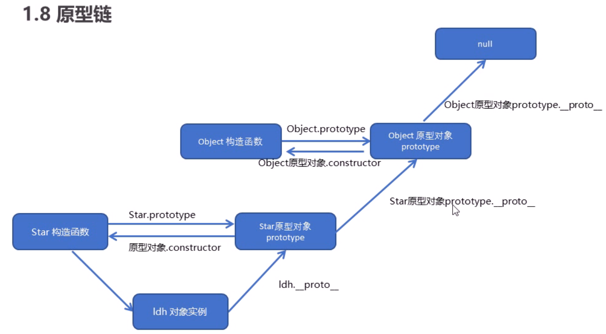

## js_advanced

### 介绍
学习js进阶技术仓库，同时练习使用git

### 参考资料

https://www.bilibili.com/video/BV1Kt411w7MP?p=11&vd_source=88e4bffc33a1ac3ec57e1b3c0320c0bf

### 学习进度记录（持续记录）

#### 2022.08.26
学习es6类的概念，构造方式以及使用

#### 2022.08.27
采用面向对象方式完成案例`切换栏制作`

#### 2022.08.28
- 学习es5中构造函数的原理
- 明白原型链的基本原理
- 学习es5的继承原理

#### 2022.08.29
- 学习了es5中的新增方法
  - 数组
    - forEach：`forEach(function{value, index, arr})`对每个数组元素进行操作，无返回值
    - map：对每个数组元素进行操作，返回操作后的数组
    - filter：返回满足条件的数组部分
    - some：是否有满足条件的元素，有直接返回true，不会继续循环
    - every：是否所有元素都满足条件，是返回true
  - 字符串
    - str.trim()：去除字符串两侧的空格
  - 对象
    - Object.keys(obj)：返回一个由属性名组成的数组
    - Object.defineProperty(obj, key, descriptor: {value : key对应的值, writable : false|true，表示是否允许重写, enumeratable : false | true，表示是否允许遍历，configurable：false |true：不允许删除，且不允许修改第三个参数 descriptor的特性})
- 学习了函数进阶知识
  - 所有函数都是Function构造函数的对象
  - 不同函数的调用方式和this的指向问题
  - 如何改变函数中的this指向
    - fn.call(thisArg, arg1, arg2, ...)
    - fn.apply()
    - fn.bind()
- 学习了严格模式的开启方式以及变化