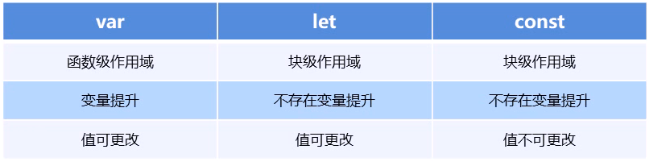

## js_advanced

### 介绍
学习js进阶技术仓库，同时练习使用git

### 参考资料

https://www.bilibili.com/video/BV1Kt411w7MP?p=11&vd_source=88e4bffc33a1ac3ec57e1b3c0320c0bf

### 学习进度记录（2022.08.31完结）

#### 2022.08.26
学习es6类的概念，构造方式以及使用

#### 2022.08.27
采用面向对象方式完成案例`切换栏制作`

#### 2022.08.28
- 学习es5中构造函数的原理
- 明白原型链的基本原理
- 学习es5的继承原理

#### 2022.08.29
- 学习了es5中的新增方法
  - 数组
    - forEach：`forEach(function{value, index, arr})`对每个数组元素进行操作，无返回值
    - map：对每个数组元素进行操作，返回操作后的数组
    - filter：返回满足条件的数组部分
    - some：是否有满足条件的元素，有直接返回true，不会继续循环
    - every：是否所有元素都满足条件，是返回true
  - 字符串
    - str.trim()：去除字符串两侧的空格
  - 对象
    - Object.keys(obj)：返回一个由属性名组成的数组
    - Object.defineProperty(obj, key, descriptor: {value : key对应的值, writable : false|true，表示是否允许重写, enumeratable : false | true，表示是否允许遍历，configurable：false |true：不允许删除，且不允许修改第三个参数 descriptor的特性})
- 学习了函数进阶知识
  - 所有函数都是Function构造函数的对象
  - 不同函数的调用方式和this的指向问题
  - 如何改变函数中的this指向
    - fn.call(thisArg, arg1, arg2, ...)
    - fn.apply()
    - fn.bind()
- 学习了严格模式的开启方式以及变化
- 学习了函数的进阶知识
  - 闭包：一个函数可以访问另一个函数作用域中变量，该变量所在函数为闭包
    - 经典面试题：闭包得到当前li的索引号
    - 立即执行函数常常是闭包
    - 返回对象，其中的属性都是函数
  - 递归
    - 用于深拷贝
  - 正则表达式
    - 创建的两种方式
    - 测试是否符合要求`/^aaa$/.test(a)`返回false
    - 边界符：^ / $
    - 字符类：[]多选一, -指定范围, 组合， [^]取反
    - 量词符：*(>=0), +(>=1), ?(0 || 1), {n}, {n, }, {n1, n2}

#### 2022.08.31 
- 正则表达式预定义类：\d \D \w \W \s \S
- 正则表达式/regExp/后跟[g/i/gi]分别表示全局、忽略大小写、全局+忽略大小写
- ES6
  - let、const、var区别
    
  - 数组解构：let[a,b,c] = [1,2,3]
  - 对象解构: let {name, age} = {name:'cjh', ahe:18}
  - 箭头函数：() => {}
    - 只有一个形参，可省略括号
    - 只有一行代码，且执行结果是返回值，可省略大括号
    - 不能使用arguments参数
    - 不能绑定this关键字
  - 剩余参数：...args，表示可以代表多个参数
  - Array扩展运算符：arr = [1,2,3]，...arr -> 1,2,3
    - 1 合并数组:[...arr1, ...arr2]或arr1.push(...arr2)
    - 2 伪数组转化为数组：[...arrLike]
  - Array.from：伪数组转化为数组
  - arr.find()、arr.findIndex()、arr.includes()
  - 模板字符串：`${}`解析变量，可以换行
  - String拓展方法：endWith、startWith、repeat
  - Set数据结构：不能包含重复内容
    - 初始化时自动去重
    - 增删改查：add\delete\has\clear
    - 遍历用forEach